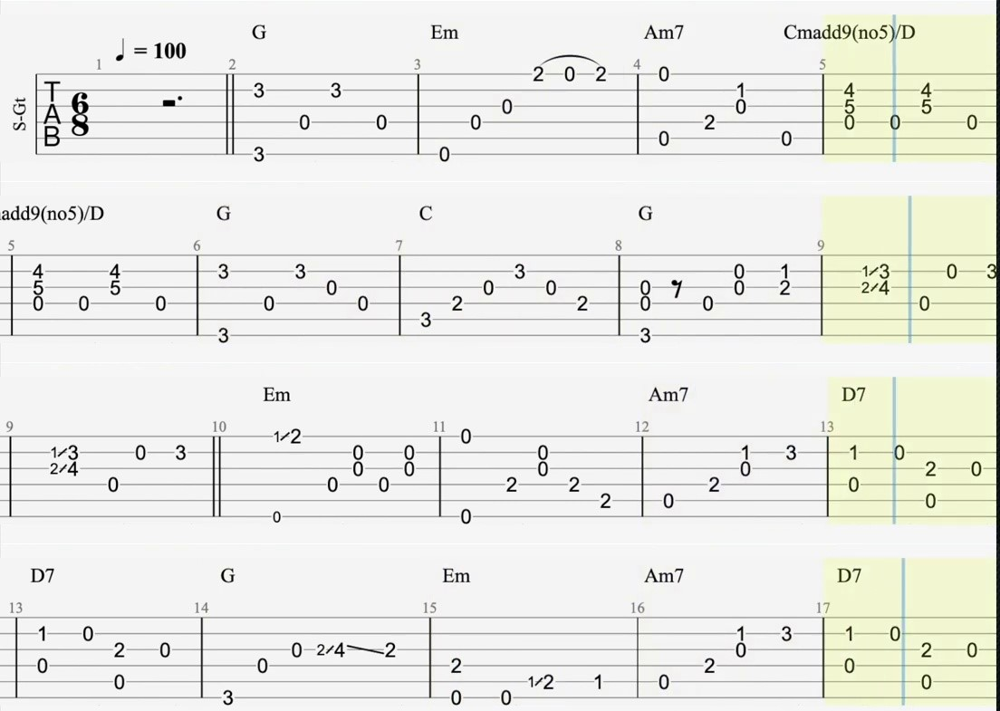

# Tab Grabber

Tab Grabber is a script intended to convert online video music tabs into a single document, removing the need to constantly pause and move the video to practice.

To use, run [tabgrab.py](tabgrab.py) and enter the video URL. Optional parameters include a path to save the document (defaults to current folder), the start time for when the tab appears to help the tool determine when to begin looking for it (defaults to 2 seconds), and how many lines of notes there should be on each page of the completed document (defaults to 5).

Tab Grabber uses computer vision to determine the position of the tab and when it switches pages, so manual adjustments may be needed for unconventional tab formats.

Example result (cropped):

Original from Kenneth Acoustic on YouTube (https://www.youtube.com/watch?v=z7-maOwsoy0)